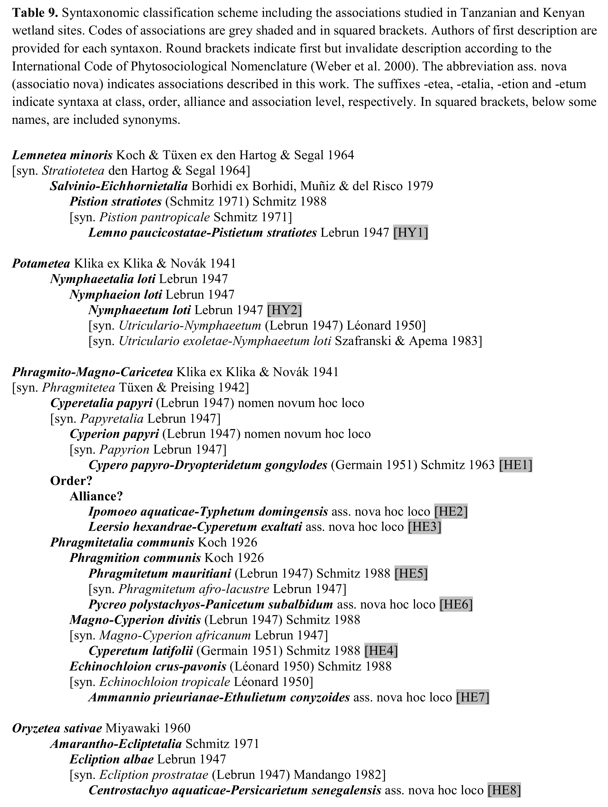

# Applying taxlist to syntaxonomic schemes
*Miguel Alvarez*

<br>

## Introduction
This guide demonstrates the application of `taxlist` objects to syntaxonomic
schemes.
For accessing this document from your **R console** use following command:


```r
browseURL("https://github.com/kamapu/Guides/blob/master/taxlist_syntax.md")
```

It is strongly recommended to install the last version of the `taxlist` package
in every session.


```r
library(devtools)
install_github("kamapu/taxlist")
```

## Example syntaxonomic scheme
For this guide it will be used as example an scheme proposed by the author for
aquatic and semi-aquatic vegetation in Tanzania (**Alvarez 2017**).
The scheme includes 10 associations classified into 4 classes:



Start the session loading the package `taxlist` and the required data:


```
## Loading required package: vegdata
```

```
## Loading required package: foreign
```

```
## This is vegdata 0.9
```

```
## This is taxlist 0.0.0.9014
```

```
## 
## Attaching package: 'taxlist'
```

```
## The following object is masked from 'package:base':
## 
##     levels
```


```r
library(taxlist)
load(url("https://github.com/kamapu/Guides/raw/master/data/wetlands_syntax.rda"))
```

The data frame `Concepts` contains the list of syntaxon names that are
considered as accepted in the previous scheme.
This list will be used to insert the new concepts in the `taxlist` object.


```r
head(Concepts)
```

```
##   TaxonConceptID Parent                                TaxonName
## 1              1     NA                         Lemnetea minoris
## 2              2      1                 Salvinio-Eichhornietalia
## 3              3      2                       Pistion stratiotes
## 4              4      3 Lemno paucicostatae-Pistietum stratiotes
## 5              5     NA                                Potametea
## 6              6      5                       Nymphaeetalia loti
##                                   AuthorName       Level
## 1    Koch & Tüxen ex den Hartog & Segal 1964       class
## 2 Borhidi ex Borhidi, Muñiz & del Risco 1979       order
## 3                (Schmitz 1971) Schmitz 1988    alliance
## 4                                Lebrun 1947 association
## 5                Klika ex Klika & Novák 1941       class
## 6                                Lebrun 1947       order
```

```r
Syntax <- new("taxlist")

levels(Syntax) <- c("association","alliance","order","class")

taxon_views(Syntax) <- data.frame(ViewID=1, Author="Alvarez M", Year=2017,
        Title="Classification of aquatic and semi-aquatic vegetation in East Africa",
        stringsAsFactors=FALSE)

Syntax <- with(Concepts, add_concept(Syntax, TaxonName=TaxonName,
                AuthorName=AuthorName, Parent=Parent, Level=Level,
                ViewID=rep(1, nrow(Concepts))))

summary(Syntax)
```

```
## object size: 10.1 Kb 
## validation of 'taxlist' object: TRUE 
## 
## number of names: 26 
## number of concepts: 26 
## trait entries: 0 
## reference entries: 1 
## 
## concepts with parents: 22 
## concepts with children: 16 
## 
## hierarchical levels: association < alliance < order < class 
## number of concepts in level association: 10
## number of concepts in level alliance: 7
## number of concepts in level order: 5
## number of concepts in level class: 4
```

Note that the function `new` created an empty object, while with `levels` the
default levels (syntaxonomical hierarchies) will be inserted.
For the later function, the levels have to be inserted from the lower to the
higher ranks.
Furthermore the reference defining the concepts included in the syntaxonomic
scheme was inserted in the object using the function `taxon_views` and finally
the concepts were inserted by the function `add_concept`.

The next step will be inserting those names that are considered as synonyms for
the respective syntaxa.
Synonyms are included in the data frame `Synonyms`.


```r
head(Synonyms)
```

```
##   TaxonConceptID                             TaxonName
## 1              1                          Stratiotetea
## 2              3                  Pistion pantropicale
## 3              8               Utriculario-Nymphaeetum
## 4              8 Utriculario exoletae-Nymphaeetum loti
## 5              9                          Phragmitetea
## 6             10                           Papyretalia
##                   AuthorName
## 1    den Hartog & Segal 1964
## 2               Schmitz 1971
## 3 (Lebrun 1947) Léonard 1950
## 4    Szafranski & Apema 1983
## 5      Tüxen & Preising 1942
## 6                Lebrun 1947
```

```r
Syntax <- with(Synonyms, add_synonym(Syntax, ConceptID=TaxonConceptID,
                TaxonName=TaxonName, AuthorName=AuthorName))
```

Finally, the codes provided for the associations will be inserted as traits
properties) of them in the slot `taxonTraits`.


```r
head(Codes)
```

```
##   TaxonConceptID Code
## 1             12  HE1
## 2             13  HE2
## 3             14  HE3
## 4             20  HE4
## 5             17  HE5
## 6             18  HE6
```

```r
taxon_traits(Syntax) <- Codes
summary(Syntax)
```

```
## object size: 12.3 Kb 
## validation of 'taxlist' object: TRUE 
## 
## number of names: 37 
## number of concepts: 26 
## trait entries: 10 
## reference entries: 1 
## 
## concepts with parents: 22 
## concepts with children: 16 
## 
## hierarchical levels: association < alliance < order < class 
## number of concepts in level association: 10
## number of concepts in level alliance: 7
## number of concepts in level order: 5
## number of concepts in level class: 4
```

For instance, you may like to get the parental chain from an association (let us
say *Nymphaeetum loti*).


```r
Nymplot <- subset(Syntax, charmatch("Nymphaeetum", TaxonName), slot="names")
Nymplot <- get_parents(Syntax, Nymplot)
summary(Nymplot, "all")
```

```
## ------------------------------ 
## concept ID: 5 
## view ID: 1 
## level: class 
## parent: none 
## 
## # accepted name: 
## 5 Potametea Klika ex Klika & Novák 1941 
## ------------------------------ 
## concept ID: 6 
## view ID: 1 
## level: order 
## parent: 5 
## 
## # accepted name: 
## 6 Nymphaeetalia loti Lebrun 1947 
## ------------------------------ 
## concept ID: 7 
## view ID: 1 
## level: alliance 
## parent: 6 
## 
## # accepted name: 
## 7 Nymphaeion loti Lebrun 1947 
## ------------------------------ 
## concept ID: 8 
## view ID: 1 
## level: association 
## parent: 7 
## 
## # accepted name: 
## 8 Nymphaeetum loti Lebrun 1947 
## 
## # synonyms (2): 
## 29 Utriculario-Nymphaeetum (Lebrun 1947) Léonard 1950 
## 30 Utriculario exoletae-Nymphaeetum loti Szafranski & Apema 1983 
## ------------------------------
```

By using the function `subset` we just created a new object containing only the
association *Nymphaeetum loti*.
This subset was then used to extract the parental chain from `Syntax`.
